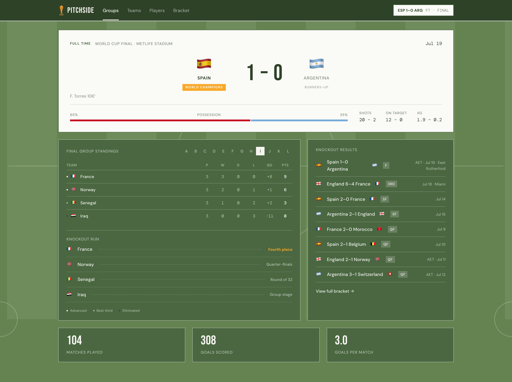
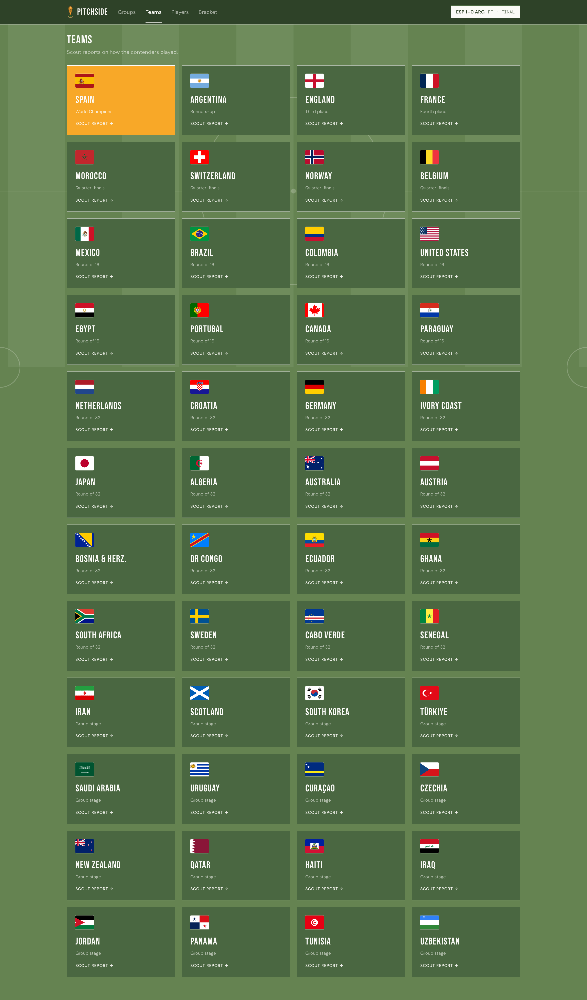
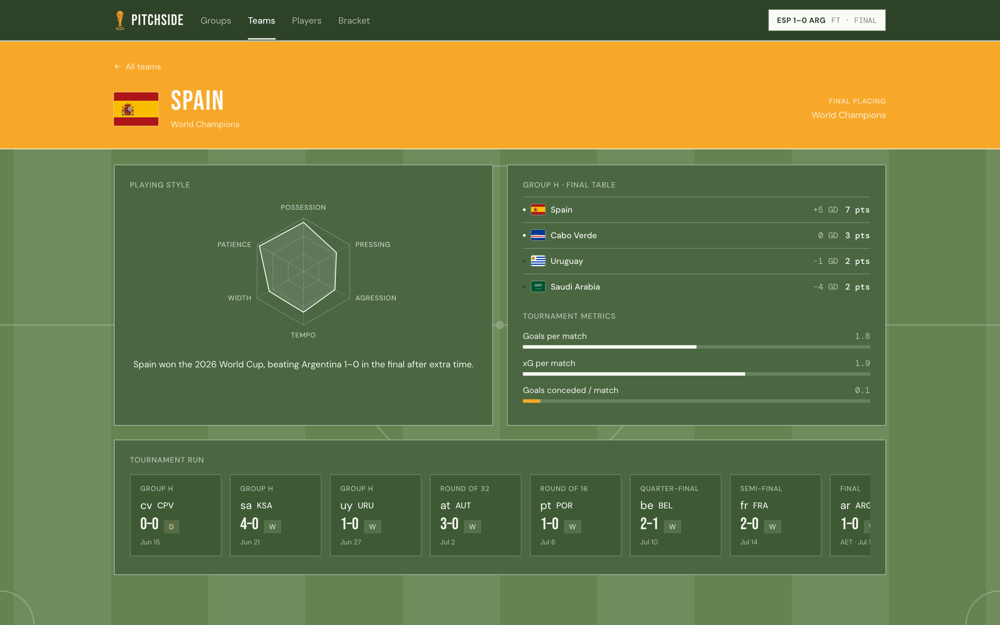
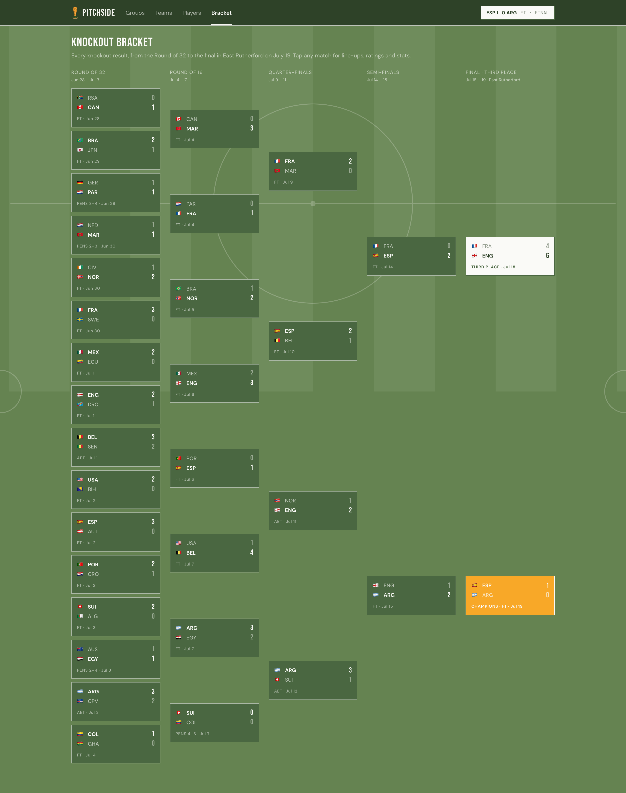
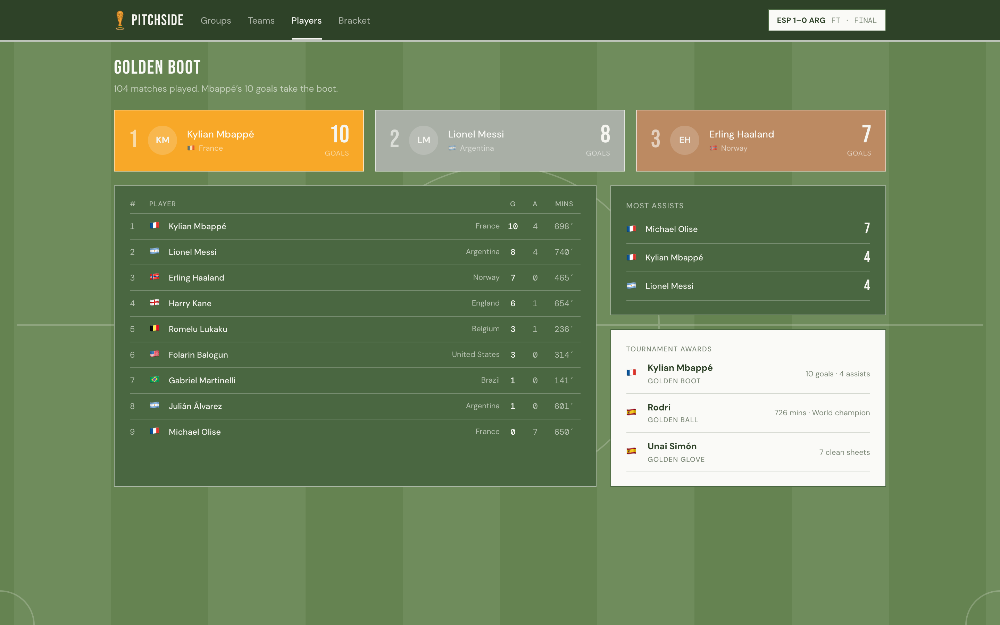
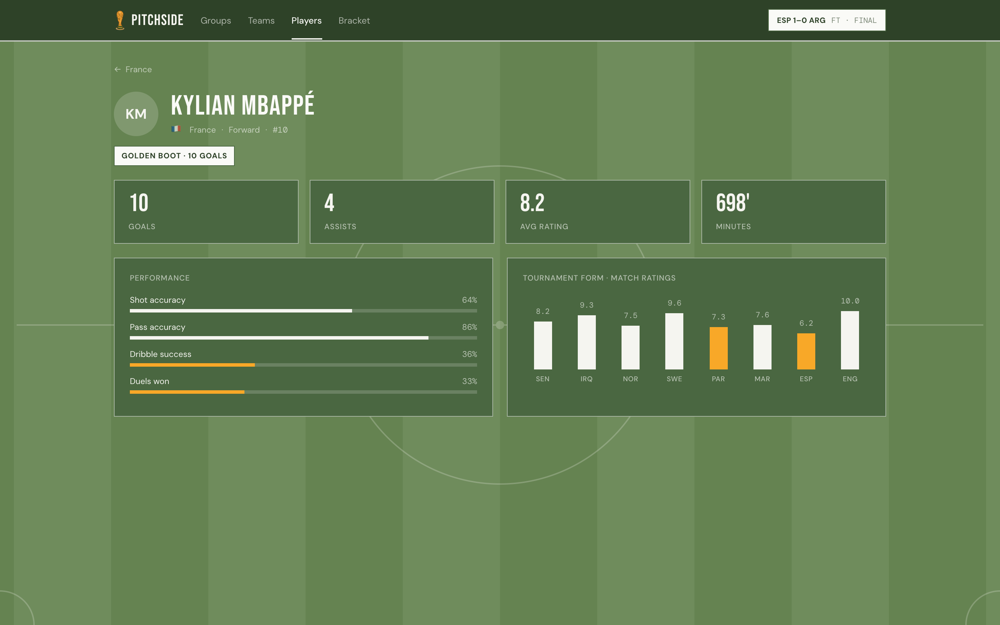

<div align="center">

# 🏆 Pitchside

### World Cup 2026, in one clean dashboard.

Group standings, the full knockout bracket, team scout reports, player stats, and tournament leaders for the completed 2026 FIFA World Cup. Spain champions, 104 matches, all in one place.


<br />



</div>

<br />

## What it does

Pitchside turns the real 2026 World Cup results into a fast, readable dashboard. Every score, standing, and stat is loaded from cached API-Football data, so the numbers match the tournament that actually happened. No live polling, no guesswork, just the finished story of the tournament laid out cleanly.

<br />

## A look around

### Groups and the final

The home page opens on the final (Spain 1-0 Argentina) and rolls down into every group table, each side's knockout run, and the headline tournament totals.


<br />

### Teams

All 48 teams, ordered by how far they went. Champions first, group-stage exits last. Every card is clickable.



<br />

### Team scout report

A per-team profile: a playing-style radar built from real match statistics, the final group table, tournament metrics, and the full match-by-match run from the group stage to their last game.



<br />

### Knockout bracket

The complete road from the Round of 32 to the final, with scores, penalty shootouts, and extra-time notes. Click any tie for the match detail.



<br />

### Leaders and awards

Top scorers and assists, plus the Golden Boot, Golden Ball, and Golden Glove.



<br />

### Player pages

Individual stat lines, performance bars from real per-match data, and a form chart across the tournament.



<br />

## Tech stack

| Layer | Stack |
|---|---|
| Frontend | React 19, Vite, Tailwind (`frontend/`) |
| Backend | FastAPI (async), SQLAlchemy 2 (`backend/`) |
| Database | PostgreSQL 16 (Docker) |
| ETL | API-Football cache, pandas transform, Postgres upsert (`backend/etl/`) |

<br />

## Run locally

```sh
# 1. Database (host port 5433)
docker compose up -d

# 2. Backend
cd backend
python3 -m venv venv && ./venv/bin/pip install -r requirements.txt
./venv/bin/alembic upgrade head        # create schema
./venv/bin/python -m etl.load          # load real tournament data (idempotent)
./venv/bin/uvicorn main:app --reload   # http://localhost:8000

# 3. Frontend (separate shell)
cd frontend
npm install
npm run dev                            # http://localhost:5173 (proxies /api to :8000)
```

Tests (offline, no database):

```sh
cd backend
./venv/bin/pip install -r requirements-dev.txt
./venv/bin/pytest
```

<br />

## API

| Endpoint | Page |
|---|---|
| `GET /api/home` | Home: hero, standings, knockout results, stats |
| `GET /api/teams` | Teams grid |
| `GET /api/teams/{id}` | Team profile (radar, group table, run, key players) |
| `GET /api/players/{id}` | Player stats, performance bars, form chart |
| `GET /api/bracket` | Knockout tree |
| `GET /api/leaders` | Top scorers, assists, awards |
| `GET /api/matches/{id}` | Match detail (scorers, stats, lineups) |
| `GET /api/stadiums` | Venues grouped by host country |
| `GET /api/health` | Liveness check |

<br />

## Data

`python -m etl.load` loads the tournament (pandas transform, then Postgres upsert, safe to re-run). It defaults to `ETL_SOURCE=api`: the real API-Football results, merged from the committed offline cache in `backend/etl/seed/raw_cache/` by `backend/etl/merge.py`. No network call is made at load time.

Set `ETL_SOURCE=seed` to load the legacy `backend/etl/seed/seed_data.json` instead, a fabricated and partial dataset kept only for local design work. Do not ship it: its results are not real.

Refresh the cache with `python -m etl.pull_raw` (needs `API_FOOTBALL_KEY`).

The dataset is a static, completed-tournament snapshot: it does not update at request time and has no live feed. Match dates are stored as date-only labels (for example "Jul 19") with no kickoff times or timezones.

<br />

## Deployment

Set these in the respective environments before deploying:

- Backend: `DATABASE_URL`, and `CORS_ORIGINS` = the deployed frontend origin(s), comma-separated.
- Frontend: `VITE_API_BASE` = the backend origin, when the built site is served from a different origin than the API. Leave unset if the API is same-origin (for example behind a reverse proxy that routes `/api`). Vite inlines this at build time, so set it in the frontend host's env and redeploy after any change.

### Live setup (Render backend + Vercel frontend)

- Backend: Render Blueprint from [render.yaml](render.yaml) provisions the Postgres + web service; build runs `alembic upgrade head` then `python -m etl.load`. Set `CORS_ORIGINS` to the exact frontend origin, no trailing slash (for example `https://pitchsidedata.app`).
- Frontend: Vercel env var `VITE_API_BASE=https://pitchside-api-x7py.onrender.com`, then redeploy.
- The web service runs on Render's Starter plan, which does not sleep. A free service would sleep after ~15 min idle and cold-start at ~50s; that needed a cron pinging `/api/health` to stay up, so restore one if the plan is ever downgraded.

### Runbook

- Refresh or re-seed data: redeploy the backend (build re-runs the ETL, which is idempotent), or run `python -m etl.load` against the DB directly.
- Free Render Postgres expires roughly 90 days after creation, then is deleted. Data recovers from the committed cache on redeploy, but the `DATABASE_URL` changes, so re-link it.

<br />

## Design reference

The extracted design reference the frontend mirrors lives in `design/template.html` and `design/logic.js` (committed). These were generated from a Claude Design export (`Pitchside - World Cup 2026.html`) that is **not** committed. To regenerate, place that export at the repo root and run `python3 scripts/extract_design.py`; otherwise use the committed `design/` files.
